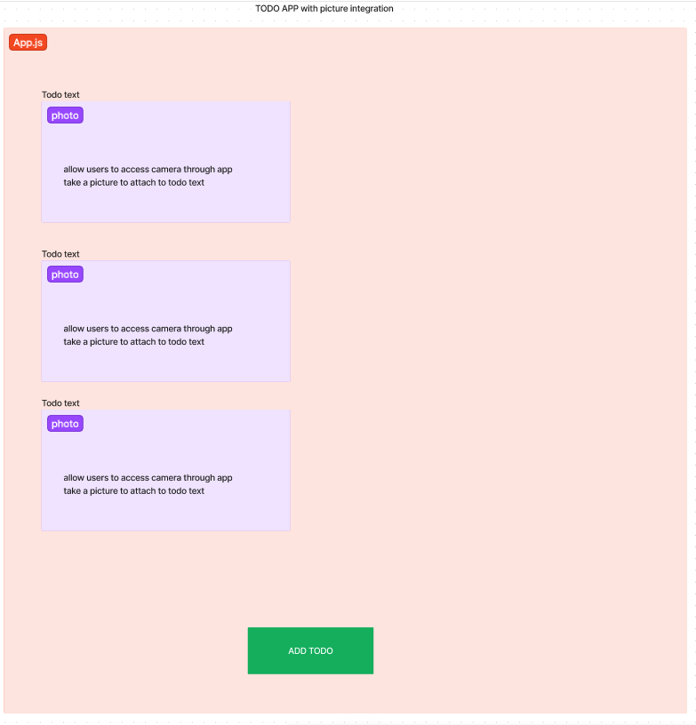

# LAB - Class 43/44

## Project: React Native Application - ToDo List with Camera Capabilities

### Author: Reece Renninger & Ike Steoger

### Problem Domain

- In our first day, MVP is bare minimum - focusing adding text ToDos and getting camera permissions to work & adding photo ToDos.
- Second day is to add in the device features, polish, and prepare for deployments.

> - As a user, I want to be able to store & easily see my ToDo tasks on my phone.
> - As a user, I want to be able to take pictures to add to my ToDo list, to add to my ToDo list without typing.

### Links and Resources

- [GitHub Actions ci/cd](https://github.com/ikesteoger/401d53-Lab43/actions)
<!-- - [back-end server url](http://xyz.com) (when applicable) -->
<!-- - [front-end application]() -->

### Collaborators

Ryan Gallaway  
Ryan Eastman  
ChatGPT  

### Setup

<!-- #### `.env` requirements

For now I have none and do not require one -->

#### How to initialize/run your application

- Clone repo down, run `npm i`, and then `npx expo start`.
- Scan the QR code with your phone through camera app with ios or expo go app with android.
- Enjoy!

<!--- #### How to use your library (where applicable) --->

#### Features / Routes

- Hold a List of ToDos that are able to hold text and/or images
- Image can either be taken with a camera or added via gallery

<!-- - GET : `/hello` - specific route to hit -->

#### Tests

<!-- - Run `npm test` to see tests running. -->

- Currently no tests written.

#### UML

